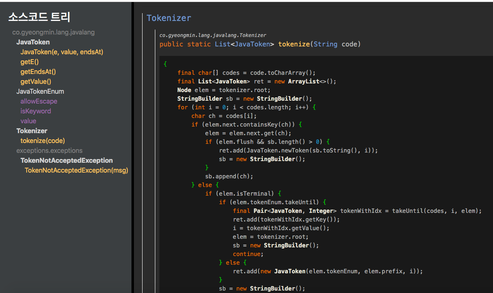

# Java Document Creator

## 설명
Scala + Java 언어로 개발된 Java 문서 생성기



## 사용방법
1. src/main/scala/co.gyeongmin.lang.javadoc.Main 오브젝트의 메인함수에서 만들어보고 싶은 자바 프로젝트 루트를 넣음
1. SBT로 실행
- ```$ sbt run```
1. 

## 사용기술
- Scala 2.12.8, Java 1.8
- HTML5, Bootstrap, JQuery
